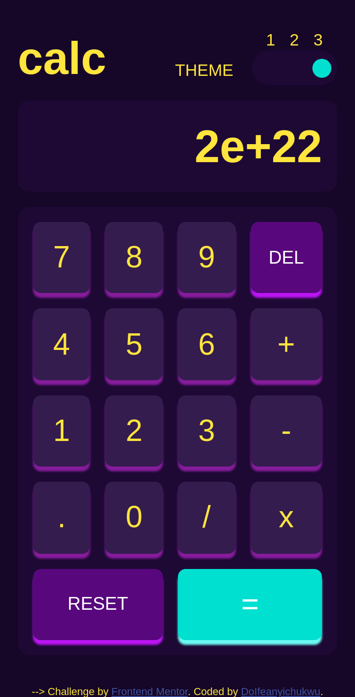

# Frontend Mentor - Calculator app solution

This is a solution to the [Calculator app challenge on Frontend Mentor](https://www.frontendmentor.io/challenges/calculator-app-9lteq5N29). Frontend Mentor challenges help you improve your coding skills by building realistic projects. 

## Table of contents

- [Overview](#overview)
  - [The challenge](#the-challenge)
  - [Screenshot](#screenshot)
  - [Links](#links)
- [My process](#my-process)
  - [Built with](#built-with)
  - [What I learned](#what-i-learned)
- [Author](#author)

## Overview

### The challenge

Users should be able to:

- See the size of the elements adjust based on their device's screen size
- Perform mathmatical operations like addition, subtraction, multiplication, and division
- Adjust the color theme based on their preference
- **Bonus**: Have their initial theme preference checked using `prefers-color-scheme` and have any additional changes saved in the browser

### Screenshot

### Links

- Solution URL: [My solution](https://github.com/HIIfeanyichukwu/calculator-app-main)
- Live Site URL: [calculator-app-main](https://calculator-app-main.surge.sh)

## My process

### Built with

- Semantic HTML5 markup
- CSS custom properties
- Flexbox
- CSS Grid
- Mobile-first workflow

### What I learned

How to use event delegation in javascript to target a group of related elements and set events on them, instead of setting events on the individual elements.

A good resource that enabled my understanding of [Event Delegation](https://javascript.info/event-delegation)

## Author

- Website - [Ifeanyichukwu Ifeanyichukwu](https://www.your-site.com)
- Frontend Mentor - [@DoIfeanyichukw](https://www.frontendmentor.io/profile/DoIfeanyichukwu)
- Twitter - [@DoIfeanyichukwu](https://www.twitter.com/DoIfeanyichukwu)

***
This readme is still in development as there are some other functionalities i plan to implement.

Will update as i progress.
